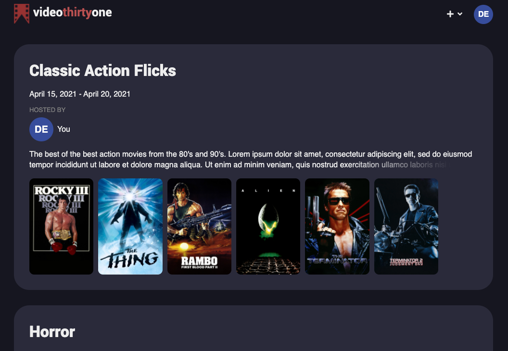
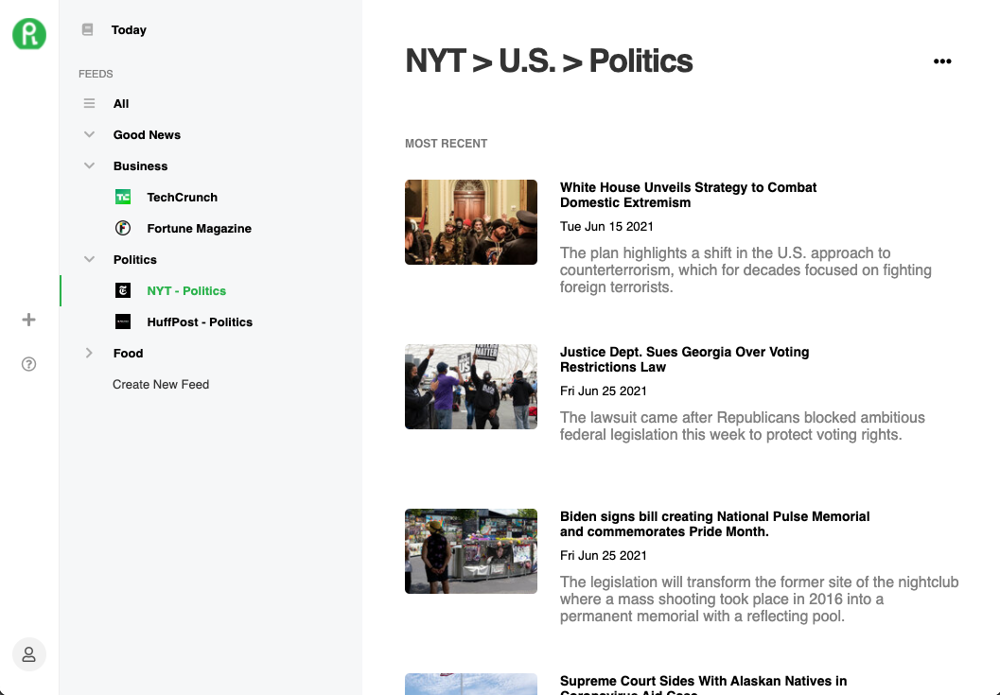
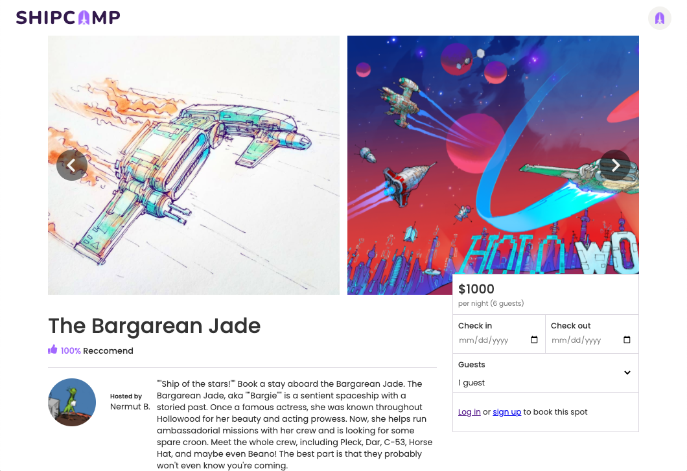

import { Link } from 'gatsby'

### Video Thirty One
[live site](https://pick-list.herokuapp.com) | [Github](https://github.com/breizeway/picklist)

Video Thirty One is a book club for films where friends create and follow curated collections of films they want to watch.
- Optimized load speed by building Redux state to first load database data then film API data only as needed and React to reduce repetitive code and increase render speed
- Utilized pure CSS to develop a uniquely styled front end from the ground-up for a pleasant UX
- Implemented a robust user authentication system using Flask-Login with extensive error handling

### Reedly
[live site](https://reedly.herokuapp.com/) | [Github](https://github.com/breizeway/reedly)

Reedly is an RSS feed aggregator that enables users to browse articles from sites with RSS feeds.
- Employed JavaScript with React and Redux on the front end and Python with Flask and SQLAlchemy on the back end to create a cohesive and fully functional feed aggregator
- Leveraged FeedParser to translate RSS feeds into JSON allowing RSS data to consistently render on the front end

### Shipcamp
[live site](https://ship-camp.herokuapp.com/) | [Github](https://github.com/breizeway/ship-camp)

Shipcamp is a clone of Hipcamp that allows users to view and book campsites on ships.
- Applied JavaScript with React and Redux on the front end and Express and Sequelize on the back end
- Incorporated AWS API to allow users to upload custom profile pictures providing for ownership of personal page

### My portfolio site

<Link to='/about'>live site</Link> | <a href='https://github.com/breizeway/portfolio'>GitHub</a>

This site. The way I structured it is actually pretty cool. I used [Gatsby](https://www.gatsbyjs.com/) along with React, GraphQL, and Markdown. The framework is Gatsby, it's built with React, and each page is a Markdown file fetched with a GraphQL query. I wanted the site to be primarily text based--I love Markdown, so what better way to build it so it is simple to understand and update moving forward?
